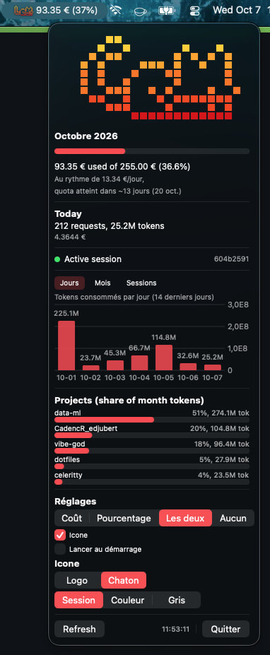

# miaou

Track and display Mistral Vibe usage (tokens, requests, estimated cost)
from local session journals, in the spirit of
[Claude God](https://github.com/Lcharvol/Claude-God), but reading only
local files (no credentials, no undocumented APIs). The mascot is a
chaton; the menu bar cat keeps an eye on your token bowl.



```
miaou/
├── cli/      Rust CLI: parsing, aggregation, budget, calibration (binary: miaou)
├── app/      SwiftUI macOS menu bar app (Miaou.app), embeds the CLI
└── Makefile  release tooling
```

## DISCLAIMER: local data only, desynchronized from Mistral

Everything here is computed from the **local session journals** written by
the Vibe CLI on **this machine**. It is not the account-wide truth: usage on
other machines, Vibe on the web, the IDE plugin or mobile is not counted,
and Mistral exposes no public endpoint to fetch account consumption. The
Mistral Console web UI is the only authoritative billing source. Plan
envelopes are observed or manually configured values, not server data.

See `cli/README.md` and `app/README.md` for the details.

## Quick start

```bash
# CLI (Rust)
cargo install --path cli
miaou summary

# macOS menu bar app (Xcode Command Line Tools required)
make -C app install-app
```

Config, calibration ledger and events archive live in
`~/.config/miaou/`.

## Release

```bash
make release
```

Builds into `dist/`:

- `Miaou.app` and a zipped `Miaou-<version>-macos-arm64.zip`
- `miaou-<version>-aarch64-apple-darwin.tar.gz`
- `miaou-<version>-aarch64-unknown-linux-musl.tar.gz`
- `miaou-<version>-x86_64-unknown-linux-musl.tar.gz`

Linux targets are cross-compiled from macOS with
[cargo-zigbuild](https://github.com/rust-cross/cargo-zigbuild):
`brew install zig && cargo install cargo-zigbuild`.
